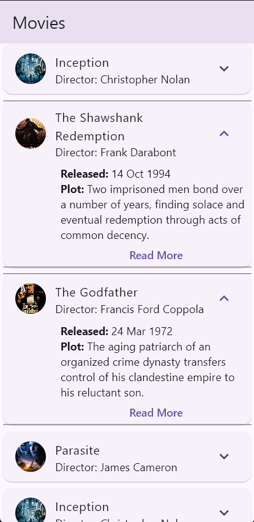
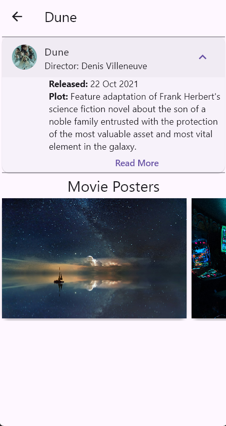
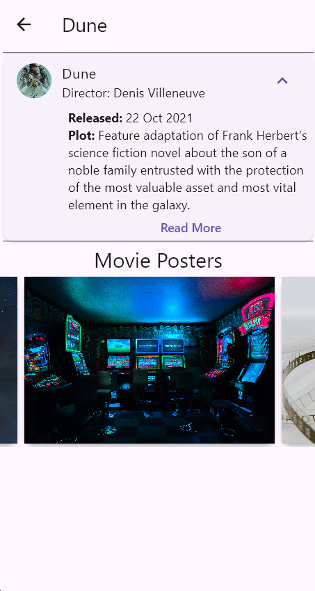

# Movie App 🎬
A simple two-page Flutter application that demonstrates my understanding of Flutter widgets, state management, and clean architecture. This project showcases how to build intuitive and visually appealing UIs using Flutter's core principles.

## Features
- Responsive UI: Clean and modern interface using Flutter widgets

- State Management: Efficient state handling with the Provider package

- Performance Optimization: ListView.builder for efficient list rendering

- Data Serialization: JSON parsing with custom model classes

- Custom Styling: Theme customization using copyWith() method

- Navigation: Smooth page transitions between home and detail screens

Home Page

Movie Details Page

